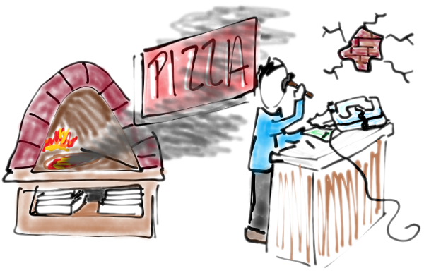

# Receiving

## Check for Messages


We learned last time how to send a message. Now it's time to learn how to receive a message. The general syntax is:

`for(message <- channel){
  // Do something here
}`

When some message show up on `channel` it gets received and is referred to as `message`. The code inside the curly braces, `{}`, is called a "continuation" and it runs when a message is received.

BTW, lines that start with `//` are called comments. They're just there for human coders and don't affect the way the program runs at all. They're a good idea, and you should use them! Anyone who reads your code will appreciate them (including your future self).


## Comm Events


The following code sends a message on a channel for a pizza shop and the pizza shop receives it. The pizza shop acknowledges receiving the message by printing to `result`.

[pizzaOrder](pizzaOrder.rho)

### Exercise
Send that message to a different channel like `coffeShop`. Did the acknowledgement print? Is anything left in the tuplespace?


### Exercise
Remember, in rholang things don't happen in any particular order, they happen concurrently. The pizza shop code will work just as well if we put the receive first. Give it a try!


## Receiving Before Sending


When a send and a receive come together on a channel, it is called a communication event, or "comm event" for short.

Unlike normal mail where a message must be sent _then_ received, the two can happen in either order or at the same time in rholang. It is just as acceptable to receive a message, then send it. Whenever a send and receive come together, a comm event takes place.


## Contracts



Our pizza shop example illustrates comm events nicely, but it isn't very realistic to expect the pizza shop to manually issue a new receive every time an incoming order consumes theirs from the tuplespace.

Luckily it's possible to deploy code once, and have it run _every_ time it receives a message. This kind of thing is called a "smart contract". Let's look at some code for a coffee shop that is much superior to the pizza shop.

[coffeeShop.rho](coffeeShop.rho)


### Exercise
Order more drinks from the coffee shop

### Exercise
Change the acknowledgement message that the coffee shop prints when it receives an order.

Which should generally come first?
- [ ] A send because that's how normal mail works.
- [ ] A receive because it's faster to run the code that way.
- [x] Either a send or a receive can come first, or they can come together.
- [ ] A receive because rholang is concurrent.
- [ ] Neither. Just make a comm event directly.

### Exercise
The channel is just named `coffeeShop`. Change it to be named after a specific coffee shop of your choosing.


## Persistent For
There are actually two different styles of syntax in rholang to achieve this persistent behavior. We just learned about `contract`, the other looks much more like a regular receive. The following snippets are equivalent.

```rholang
contract coffeeShop(order) = {
```

```rholang
for(order <= coffeeShop) {
```
Notice this is different from a normal `for` because it has a double arrow `<=` rather than a single arrow `<-`. The only difference between the persistent for and a contract comes when we start talking about blockchains. For now you can think of them as the same thing.

### Exercise
The pizza shop could use a contract like the one the coffee shop had. Let's write it one but use a persistent for instead of a contract. Try to write the entire thing from scratch so you remember the syntax better.
<!-- The solution is in persistentPizzaShop.rho
[persistentPizzaShop.rho](persistentPizzaShop.rho) -->


Which of these things is not like the other?
- [x] `for (a <- b){}`
- [ ] `contract b(a) = {}`
- [ ] `for (a <= b){}`

Which send will produce a comm event with `for (message <- grandmasSnapChat){Nil}`?
- [ ] `for(grandmasSnapChat)!("Hi Grandma")`
- [x] `grandmasSnapChat!("Glad you're snapping Grandma")`
- [ ] `for("Here's a snap for you g'ma" <- grandmasSnapChat)`
