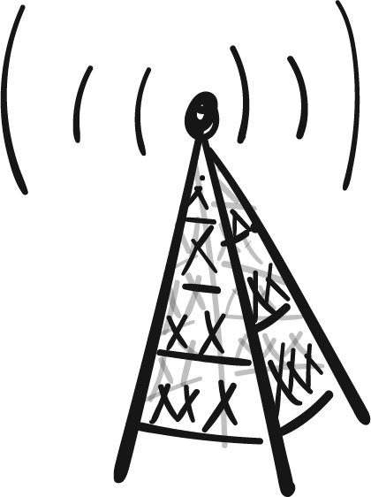

# Persistent Sends and Peek

## Why send repeatedly?

Our pizza and coffee shops were both interested in receiving many messages on the same reusable channel. We accomplished that with a persistent for `for (msg <= chan){...}` or a contract `contract chan(msg){...}`.

An air traffic control tower may be interested in doing just the opposite -- sending the same message over and over. The controllers in the tower want to record a message containing weather and active runway information once, and make it available for every pilot who needs it. Like the pizza shop, they are busy and can't be bothered to continually re-send the message every time a pilot consumes it.

## Persistent send syntax

The control tower just needs a minor adjustment in their code to make the send persistent. Rather than sending with a single `!`, they will use a double `!!`.

[persistentSend.rho](persistentSend.rho)

Confirm for yourself that the original send is still in the tuplespace.

### Exercise
Modify the above code so that a second pilot also receives the information. Still, the send persists.

By the way, did you notice that we don't need `new result(...) in {}` when we don't actually print anything to the screen `result`?

How many comm events happen in `for (x <- y) {Nil} | y!!(Nil)`
- [x] `1`
- [ ] `many`
- [ ] `0`

## Double Checking a Message

Persistent sends and receives are very useful as we just showed. But often normal sends and receives are perfectly good too. Imagine that the air traffic controllers want to update the airport information when the weather changes. If they use a persistent send, they cannot make updates.

A better solution is to use a normal send and require each pilot who receives the message to put it back on the channel when they are done.

[putBack.rho](putBack.rho)

### Exercise
Using what you already know, you can you can complete the code for an honest pilot to return the info to the `airportInfo` channel.

Give that a try on your own first. The solution is listed below.

How many comms happen in `for (x <= y) {Nil} | y!!(Nil)`
- [ ] `1`
- [x] `many`
- [ ] `0`

## Peek Syntax
One problem with the code above is that a forgetful pilot may not actually put the information back on the `airportInfo` channel causing problems for other pilots who need it. A better solution would be to not actually _receive_ the message off of the channel in the first place.

To "peek" at what's on a channel without consuming it, use the `<<-` operator.

[peek.rho](peek.rho)

Which syntax is used to peek at a message?
- [x] `for (x <<- y){...}`
- [ ] `for (x <= y){...}`
- [ ] `x!!(y)`

How many comms happen in `for (x <! y) {Nil} | y!!(Nil)`
- [x] `1`
- [ ] `many`
- [ ] `0`

## Security warning
We've solved the problem of forgetful pilots removing the message and forgeting to put it back by teaching them to use peek instead. But this still doesn't solve the problem of malicios pilots intentionally taking the data. In reality we need to _enforce_ that nobody can leave `airportInfo` blank. We'll see how to do that in lesson 6.
