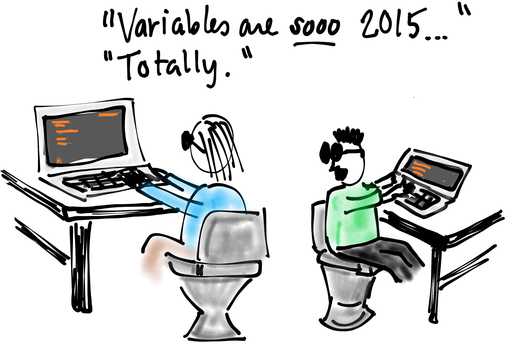
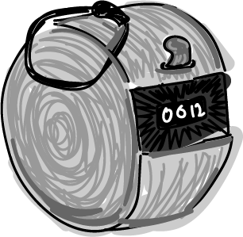

#  State Channels

## Holding on to data



By now you're good at sending data to the tuplespace, and receiving data from the tuplespace. But whenever you're computing, you occasionally need to set data aside to be used later. Almost every programming language has a concept of variables.

Another way in which rholang is unique is that it doesn't have traditional variables. Instead, we can just use the tuplespace to store our data. Whenever you want to set something aside for later, just send it on some channel and receive it back later. Channels that are used in this way are called "state channels", and often have `Ch` at the end of their name

[box.rho](box.rho)


What data gets sent to `@somePublicChannel`?
- [ ] 0
- [ ] box
- [x] 42
- [ ] It is empty


What data is left in the `boxCh` state channel?
- [ ] 0
- [ ] @"somePublicBox"
- [ ] 42
- [x] It is empty


## Persisting Data
If we were to check the box again, we would not get a result. Because once we receive the message, it gets consumed from the tuplespace. We briefly discussed the solution back in our lesson on persistent sends and peeks.

[persistentBox.rho](persistentBox.rho)

What data gets sent to `@somePublicChannel`?
- [ ] 0
- [ ] box
- [x] 42
- [ ] It is empty


What data is left in the `boxCh` state channel?
- [ ] 0
- [ ] @"somePublicBox"
- [x] 42
- [ ] It is empty


## Patience Game Revisited
A few lessons back we discussed the patience game, where each player hopes to be the last one to send a message to the contract. We had some problems back then because we couldn't guarantee that a result of the game would ever be output.

Take a minute to remind yourself of the problem we had. With a state channel, we can solve this problem properly.

[patience.rho](patience.rho)

How does the above code avoid the problem of each block getting called once?
- [ ] By forcing player one to use the top block
- [x] Because after the first call `activeCh` is empty
- [ ] Because state channel make things sequential

## Objects and Methods


In "Object Oriented Programming" languages such as java, we can model real-world objects by encapsulating some data along with methods that use or change the data. The same thing is possible in rholang.

In this example, we'll create an object that represents a basic click counter. The ingredients are:
* State Channels: currentCount
* Methods: increase, reset

[counter.rho](counter.rho)

### Exercises
It is inconvenient to manually replace the counter value each time I check it. Instead we should have a method for that.

<!-- answer in checkMethod.rho -->


### Exercise
Now that it's easier and safer to check the counter, let's write some better tests that actually check all the methods.

<!-- answer in counterTests.rho -->

## Factories
If you've programmed in other languages like java you may be familiar with constructors. If you haven't programmed in in java, that's great, because Rholang uses factories to make new objects rather than constructors.

The counter is a useful construct in rholang, and you'll likely find that you use it in your projects. The problem is that many projects may want to use counters, and having just one is insufficient. So the solution is to make a factory contract that makes counters. When the factory contract is called, it sends back a brand new counter.

[counterFactory.rho](counterFactory.rho)

How would a user call the factory to get a new counter?
- [ ] `counterFactory!(*ack)`
- [ ] `counterFactory!(0, *ack)`
- [ ] `@"counterFactory"()`
- [x] `counterFactory!(myIncrease, myReset)`

How would a user reset their counter after creating as indicated above.
- [ ] `myIncrease!(*ack)`
- [x] `myReset!(*ack)`
- [ ] `counterFactory!(myReset, *ack)`
- [ ] `counterFactory!(myReset)`


## Method Dispatching
There are two primary techniques for making methods available. The first option I call "separation of powers" because each method listens on its own dedicated channel.

Another option is the "control panel" technique where there is a single unforgeable name called the control panel and all the methods are built on it.

```
// Separation of Powers
contract factory(method1, method2) = {
  contract method1(ack) = { ... }
  contract method2(ack) = { ... }
}

// Control Panel
contract factory(cPanel) = {
  contract @[cPanel, "method1"](ack) = { ... }
  contract @[cPanel, "method2"](ack) = { ... }
}
```

Which technique did the counter example use to dispatch methods?
- [x] Separation of Powers
- [ ] Control Panel

### Exercise
Convert the counter example to use the other method dispatching technique. You should convert the tests too.
