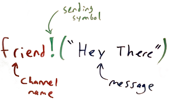

# Sending and Standard Out

## Say Hello


There is a long-standing tradition in programming that your first program should say "Hello World". Here's the simplest rholang code to put that text on the screen.

[hello.rho](hello.rho)

### Exercise
Make the program print "Rholang rocks!" instead of "Hello World".

### Exercise
Try to change "stdout" to something else. Any results?.
* Try this funny channel name `@"someChannel"`.
* We're casual here. Make the program say "Sup World" on the screen.


## WTH is stdout?


The heart of rholang is communicating on channels. Channels are communication lines that you use to send and receive messages. To send a message on a channel, you use the `!` character.



`stdout` is a special channel that is used to send text to "standard out" which usually just means your computer screen. Because it's special, we had to have that first line of code.


## Using other channels


You can actually send messages on lots of channels, not just `stdout`. But unlike `stdout` they won't display on the screen.

[tupleSpace.rho](tupleSpace.rho)

So where do the other channels go then? Nowhere! Not yet anyway. The messages just sit there waiting for someone to receive or "consume" them. We'll learn how to consume messages in the next lesson. The place where messages sit in the meantime is called the "tuplespace".

Make sure your message is sitting in the tuplespace. You should see some text like this.

```
Storage Contents:
 @{"RandoChannel"}!("This won't be on the screen") | for( x0, x1 <= @{Unforgeable(0x01)} ) { Nil } | for( x0, x1, x2, x3 <= @{"secp256k1Verify"} ) { Nil } | for( x0, x1 <= @{"sha256Hash"} ) { Nil } | for( x0, x1 <= @{Unforgeable(0x03)} ) { Nil } | for( x0, x1, x2, x3 <= @{"ed25519Verify"} ) { Nil } | for( x0, x1 <= @{"blake2b256Hash"} ) { Nil } | for( x0 <= @{Unforgeable(0x02)} ) { Nil } | for( x0 <= @{Unforgeable(0x00)} ) { Nil } | for( x0, x1 <= @{"keccak256Hash"} ) { Nil }
```


## Doing two things at once


In rholang we don't tell the computer to do one thing, then another, then a third. Rather we tell it all the things to do, and it does them "concurrently," or all at once.

[parallel.rho](parallel.rho)

The `|` is pronounced "parallel", or "par" for short.


### Exercise
Send the message "1 large pepperoni please" on a channel called "pizza shop".

### Exercise
Send "Hi Mom" on the channel "Mom's Phone".

### Exercise
Print two messages, "Rick" and "Morty", on the screen in one program.


## Quiz

What will `stdout!("Programming!")` print to the screen?
- [x] Programming!
- [ ] stdout!
- [ ] Nothing


What channel does `@"what"!("Up")` send a message on?
- [ ] `@"Up"`
- [x] `@"what"`
- [ ] `what`


Which does rholang do first in
```
@"stdout"!("Dogs")
|
@"stdout"!("Cats")
```
- [ ] prints "Dogs"
- [ ] prints "Cats"
- [x] Neither. They are concurrent


PS. There is also a special channel called `stderr`. Check out what happens when you send to it.

[what's the difference?](https://en.wikipedia.org/wiki/Standard_streams)
