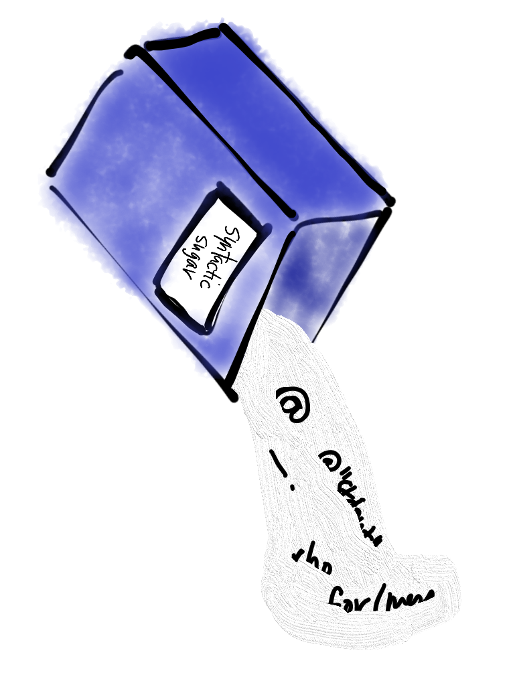

# Pattern Matching

## About Patterns
Patterns occur all over in daily life. If you saw a new model of car that you had never seem before you would still know it is a car because it matches a mental pattern you have for cars that probably involves four wheels, two or four doors, and a windshield to see out of.

Similarly, we can match sentence patterns. The sentences "I like cheese" and "I like pandas" both match the pattern "I like ____". But "I have a dog" does not match that pattern. Rholang allows programmers to use pattern matching to control program execution. That is, different code can run depending whether a process matches a certain pattern.

## The `match` construct
The most obvious place that rholang uses pattern matching is in its `match` construct which works as shown here.

[matching.rho](matching.rho)

In this code any massage `x` that is received on the `patternMatcher` channel represents a quoted process. We compare that process (unquoted) to several patterns below and report back what pattern matches. The underscore is just a fill-in-the-blank and matches any pattern at all. It is called a "wildcard", and you'll often see it as the final pattern in a `match` construct to ensure that there is a default case if nothing else matches.

<!---->

Pattern matching can also be used when receiving messages with `for` or `contract`. In order for a message to be received, the message that was sent, must match the pattern that is to be received. We'll see an example of this usage shortly.

## Two cases we've seen
We've already used the underscore occasionally. For example I often write `for (_ <- ack)` which means, receive a message matching _any_ pattern on the `ack` channel. It is standard practice to use the underscore when you only care that you _have_ received a message, but not _what_ message.

We also used pattern matching in the previous lesson when we learned how to receive processes. When we write `for (@p <- x)` it means receive any message that matches the pattern of a quoted process, and bind that quoted process to the  p.

What would the variable `p` be bound to in `x!("hello") | for(@p <- x){Nil}`
- [ ] `@"hello"`
- [x] `"hello"`
- [ ] `hello`
- [ ] `4`

What would the variable `p` be bound to in `x!("hello" | 4) | for(@{"hello" | p} <- x){Nil}`
- [ ] `@"hello"`
- [ ] `"hello"`
- [ ] `hello`
- [x] `4`

## Syntactic sugar

It turns out that pattern matching can be used to totally replace the `if`/`else` construct we learned previously. In fact, that is exactly what `if`/`else` means under the hood. Because it is just shorthand for other syntax, `if`/`else` is said to be syntactic sugar. The following code snippets are exactly equivalent
```
if (cond) {
  // Do Process P
}
else {
  // Do Process Q
}
```
into
```
match cond {
  true => // Do Process P
  false => // Do Process Q
}
```

### Exercise
Rewrite our `signTest.rho` example from the previous lesson to use `match` instead of the sugary `if`/`else`.

How could we rewrite the first `match` example above to use `if`/`else`?
- [ ] Just the reverse of the previous exercise
- [ ] Start with `if (x == a|b)`
- [x] We can't because that example matches patterns more complex than just `true` and `false`


## A Nicer Greeter
Let's make a nicer greeter that still says hello even if we don't tell it our name. The key here is that we have two different contracts listening on the exact same `greeter` channel.
[greeter2.rho](greeter2.rho)

You can probably understand how each of those contracts works individually. The interesting new part is how rholang decides which contract to actually run when a message comes along on the `greeter` channel. The trick is that rholang will run whichever contract has parameters that match the pattern we sent. If I send two parameters, the greeter that takes two parameters will be called. If I send just one parameter, the contract that takes just one parameter will be called. In the future, rholang will also support pattern matching on the _type_ of the parameters sent.

### Exercise
Write a series of contracts that calculate the area of a rectangle. In the most obvious case the caller will provide both a length and width. But the user may also provide only a single width in which case the rectangle is actually a square and both sides are the provided width. Finally, the user may provide no dimensions at all in which case the rectangle is a 1x1 square.

## Advanced pattern matching
You can do cool things with pattern matching like `for(@{x!(P)} <- y){ Q }` which will only reduce if the process sent on channel `x` matches the pattern of a single send. Then in the process Q you will have bound the variables `x`, the channel, and `P`, the process being sent

[sendASend.rho](sendASend.rho)

Will `x!("hello") | for ({"hello" | "world"} <- x){Nil}` cause a comm event?
- [ ] Yes because the send and receive are on the same channel
- [ ] Yes because the send and receive are on the same channel AND the pattern matches
- [ ] No because the send and receive are on different channels
- [x] No because the send and receive are on the same channel, but the pattern doesn't match

## Unions and Intersections

There may be times when you want to match either of two patterns, or you want to match both a two patterns. These operations feel similar to the Booleans we discussed in the last lesson, but we use different operators when pattern matching.

To match any one of several patterns you use the "union" operator, `\/`

[union.rho](union.rho)

To match both of two patterns you use the "intersection" operator, `/\`. In this example we are verifying that registration data is valid. A registrant must supply their name and age, and may supply any amount of additional data. By the way, this technique for storing key-value data is often known as "RHOCore".

[intersection.rho](intersection.rho)

Notice I called my result channel `print` that time. You can call those names anything you'd like. Although it's generally good to be consistent so as not to confuse anyone. From here on I'll stick with `result`.

### Exercise
The union example here is pretty basic. Expand it so it can match more languages and more words. Also write tests that show what happens when only the default pattern is matched.

The logical connectives discussed in this section have some subtle behavior related to binding that is beyond the scope of this tutorial. I encourage you to experiment with example programs, and refer to the Rholang manual when it becomes available.

## More About Bundles
Several lessons ago we discussed how bundles can be used to make read- or write-only channels. But we haven't yet discussed their namesake feature. Bundles can be used to "bundle up" compound names so that they can't be taken apart by pattern matching.

In this example code an army has a missile and they maintain control of launching the missile by building the capability on an unforgeable name. Because of diplomatic relationships, the army will allow the public to inspect the missile for safety, but certainly not launch it.

[missileUnsafe.rho](missileUnsafe.rho)

### Exercise
The army has made a terrible mistake here and anyone can launch their missile. Try to think of a way that an outside could launch this missile.

Answer:
[missileAttack.rho](missileAttack.rho)

In order to solve the problem the army simply gives out a bundled version of the compound name so that it cannot be taken apart by pattern matching.

[missileSafe.rho](missileSafe.rho)

What will be output when the attack is run on the safe code?
- [ ] "launching..."
- [ ] "inspecting..."
- [ ] "failed to launch..."
- [x] nothing
