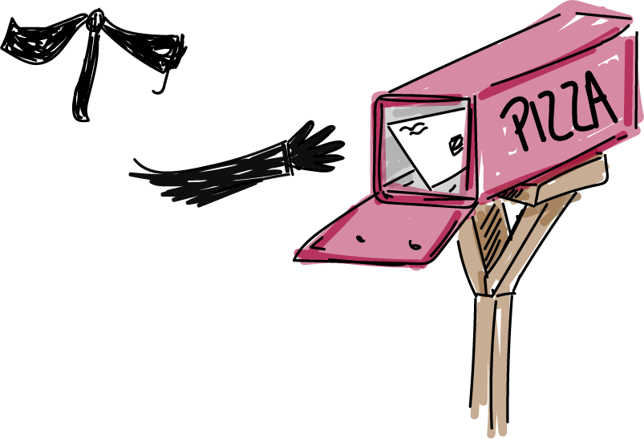

# Unforgeable Names and Acks

## Making Channels "Private"

So far every channel we've sent on has been a public name like `@"pizzaShop"`. Anyone can send a message to this channel (which is good for business) but anyone can receive a message on it too (which is terrible for business). Imagine if competitors could consume pizza orders so that the pizza shop never received them.

What code would a bad pizza shop have to write to intercept orders?`
- [ ] `contract evilPizzaShop(interceptedMessage) = {0}`
- [ ] `@"evilPizzaShop"!("pizzaShop")`
- [ ] `@"pizzaShop"!("intercept")`
- [x] `for (interceptedMessage &lt;- @"pizzaShop"){...}`

## Bound and Free Names

We learned how to receive messages with `for` and `contract` last time. Both of these constructs "bind" names. For example, order is a bound name within the coffee shop code.

[bound1.rho](bound1.rho)

The same is true when we use contracts.

[bound2.rho](bound2.rho)

A name is considered bound if it only exists inside a specific process and can't be accessed from outside. So the name order is bound in the coffee code. On the other hand, any name that can be accessed from elsewhere is a "free" name. `@"coffeeShop"` is a free name in the above examples.

State whether `x` is bound or free in each of the following code snippets.

`for (x &lt;- y){0}`
- [x] Bound
- [ ] Free
- [ ] Neither

`for (y &lt;- x){0}`
- [ ] Bound
- [x] Free
- [ ] Neither

`new x in { x!(true) }`
- [x] Bound
- [ ] Free
- [ ] Neither

`contract x(y) = { 0 }`
- [ ] Bound
- [x] Free
- [ ] Neither

`contract y(x) = { 0 }`
- [x] Bound
- [ ] Free
- [ ] Neither

`for (y &lt;- @"x"){0}`
- [ ] Bound
- [ ] Free
- [x] Neither

## The `new` Operator
`for` and `contract` are perfect for binding names inside of continuations. But what if we want to create a bound name to send messages on? For example, our pizza shop would prefer not to have its orders intercepted. We solve this with the `new` operator.

[newPizzaShop.rho](newPizzaShop.rho)

First notice that `pizzaShop` is a name even though it doesn't start with `@`. That's because the `new` operator created it as a name directly rather than by quoting some written-down process. Whenever you create a `new` name, it is always a bound name.

Second, notice that while this technique does prevent other pizza shops from consuming orders, it also prevents new customers from ordering. We'll solve this problem in the lesson on bundles.

What happens when you try to order a pizza fron outside of the `new` restriction.
- [ ] The order works fine
- [ ] The order works but takes much longer
- [x] Error about top-level free variables
- [ ] The code runs, but no order is received

We learned that all names quote processes. So what process does the `pizzaShop` name quote? Try printing the process to `stdout` to see
- [ ] It quotes "pizzaShop"
- [ ] It doesn't quote anything
- [x] "Some Unforgeable hex code"

## Private vs Unforgeable

`new` is known as the restriction operator because it restricts use of the bound names that it creates to within it curly braces or "lexical scope". Within the world of the rholang these new names really are only visible within the correct scope, but remember that human programmers can look in to that world from the outside. That is especially true when working in a blockchain context.

So while a competing pizza shop can no longer _consume_ pizza orders intended for our shop, they can still read the orders with a block explorer. Occasionally programmers call `new` names "private", but a better term is "unforgeable", which explains the answer to the previous question.

## Acknowledgement Channels

One common use of unforgeable names is "acknowledgement channels", usually called "ack" channels for short. Instead of confirming orders by printing to the screen and disturbing _everyone_, the pizza shop should really just let the _customer_ know that the order has been placed.

To do that the pizza shop needs to know how to contact the customer. So the customer should supply an acknowledgement channel to be called back on. Traditionally such a channel is named `ack`.

[pizzaAck.rho](pizzaAck.rho)

Why don't the acknowledgements in the previous example show up on the screen?
- [ ] There is a bug in the code
- [ ] The orders were not received correctly
- [x] The confirmation was not sent to `stdout`

### Exercise
The previous example causes tuplespace pollution on the channels `@"Alice"` and `@"Bob"`. Fix it so that Alice and Bob both have unforgeable names.

## Sending Names Gives Permission
We just saw how the customer can give the shop an ack channel to receive order confirmation. It turns out we can do even better. With our previous code, anyone could contact the customer on the ack channel. That means anyone could send a forged ack making the customer think the order was placed when really it wasn't. Really Alice and Bob should keep their unforgeable names under tight control. Because giving someone that name gives them the capability to contact you.

[privateAck.rho](privateAck.rho)

The solution is to create a new unforgeable name, and give it to the pizza shop so that only they can call you back. Even though the pizza shop is _outside_ of the `new alice`, it can still send on the channel because alice gave it the channels name. This is a wonderful way to delegate priveledges.

In this example we trust the shop to only _send_ on the ack channel, but notice that it could also receive if it wanted to. We'll learn how to give out only some of those permissions in the next lesson on bundles.

Bob also wants to order a pizza and give a unforgeable ack channel. Where should he create his unforgeable channel?
- [x] On his own line, after the alice code
- [ ] On the same line the Alice did
- [ ] On the very first l
ine of the program

## `stdoutAck` and `stderrAck`

Now that you understand ack channels, you should know about two other ways to print to the screen. They are channels called `stdoutAck` and `stderrAck`. They work just like their cousins from lesson 1, but they take an ack channel.

[stdoutAck.rho](stdoutAck.rho)

By the way, did you ever notice the handful of stuff that always starts in a fresh tuplespace? Four of those things are the built-in receives for the screen-printing channels. The others are for cryptography. We'll discuss them later.

### Exercise
`stdout!("1")|stdout!("2")|stdout!("3")`
Notice that this program does not print the numbers in any particular order. The calls happen concurrently. Imagine we really need these lines to print in order. Modify the code to use ack channels and ensure that the numbers get printed in order.

### Exercise
Predict how this program will run (what it outputs and how it reduces in the tuplespace). Then run it to test your prediction.
`
new myChan in {
  myChan!("Hi There")
}
|
for (msg &lt;- myChan) {stdout!(*msg)}
`

If your prediction for the previous exercise was wrong, modify the program so it actually does what you predicted it would.

## Quiz

Which name is bound in `for(x &lt;- y){0}`
- [x] `x`
- [ ] `y`
- [ ] `0`

Which name is bound in `new x in {0}`
- [x] `x`
- [ ] `y`
- [ ] `0`

If `pizzzaShop` is a name, then what is `@pizzaShop`?
- [ ] A name
- [ ] A process
- [x] Invalid syntax

Why did the pizzaShopAck code send `"bob"` as an ack channel instead of `@"bob"`?
- [ ] No reason; it's just a style choice.
- [x] Because @"bob" is a name, but we have to send processes.
- [ ] That's special syntax for ack channels.
