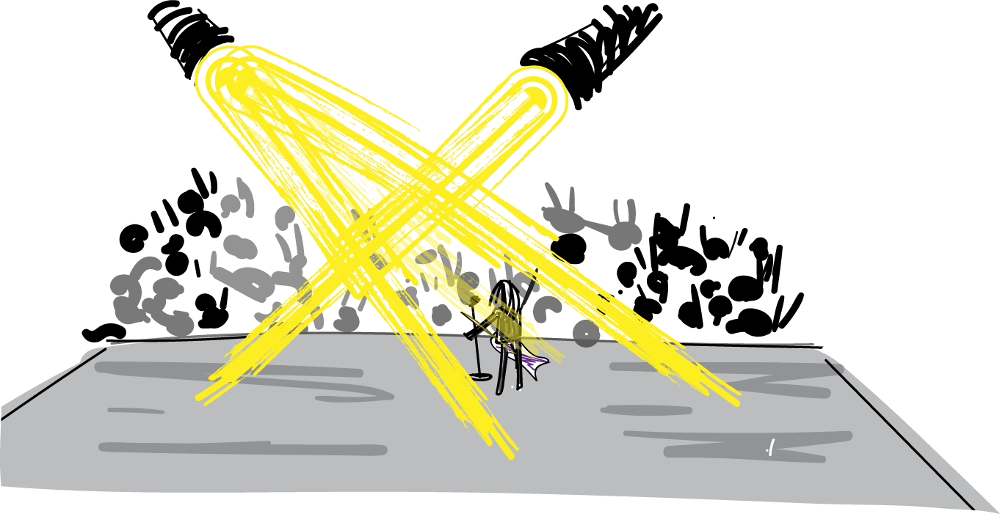

# Bundles

## Stolen Messages

Alice is a rising celebrity who receives mail from her fans. They used to send mail directly to her on a public name.

[fanmailBad.rho](fanmailBad.rho)

But as she became more popular, her jealous competitor Eve began stealing her mail.

### Exercise
Write the code for a competitor to steal the mail  <!-- Answer in fanmailEve.rho -->

The problem is that the competitors can listen on the same channel Alice can. So what she really needs is for her fans to have a "write-only bundle"

[fanmailPublish.rho](fanmailPublish.rho)

The `bundle+ {*aliceFanMail}` is a channel just like `aliceFanMail` except it can only be snet on, not received.

## Subscriptions
The bundle solution above does prevent Ewritten onve from stealing mail, which is good. But in the blockchain context it also has the unfortunate side effect that Alice has to pay to send her fanmail address. Blockchain fees work a little like postage.

### Exercise

Alice can save postage by making fans request the fanmail address from her. Then they will have to pay the transaction costs. A bit like sending a return envelope with a stamp already on it.

Complete Alice's code so that she can get Bob the address he needs.

Here's the answer:
[fanmailAsk.rho](fanmailAsk.rho)

Astute readers will notice that Eve can now just intercept messages asking for the fanmail address. Good observation. As a bonus exercise, you could write Eve's new code. (hint: it's the same as the old code). The solution to this problem involves public key cryptography and the registry. We'll learn about that in unit 4.

### Exercise
Our pizza shop back in lesson 2 had a similar problem to Alice. Rework that code so they can easily take on new customers.

## Jackpot

I used to play a game called jackpot as a kid. One player would throw the ball and yell a number. The other players would all try to catch the ball and whoever caught it would receive that number of points.

Playing jackpot is just the opposite of sending fanmail. Before there were many fans all sending to one celebrity. Now there is one thrower, sending to one of many recipients

[jackpot.rho](jackpot.rho)

Who will catch the ball in the jackpot code?
- [ ] Bill because his catch code is first.
- [ ] Bill because his catch code is closest to the throw code.
- [ ] Paige because her catch code is last.
- [x] We don't know; it is nondeterminate.

### Exercise
Exercise: Use stdoutAck to display how many points each person actually gets when they catch the ball.
<!-- solution in jackpotNicePrinting.rho -->

Most programming languages will allow you to join or "concatenate" two strings together, and rholang is no exception. We can `stdout!("Hello " ++ "world")`, but we can't concatenate a string with an int. That's why we had to use that `stdoutAck` trick. Another option is to print a list  `stdout!(["Bill caught it. Points earned: ", *points])`. We'll go into more detail about both techniques in future lessons.

How is this game in rholang different than the real game where one ball is throw repeatedly?
- [ ] It is a very accurate simulation
- [x] In rholang all balls are thrown at once and caught in any order
- [ ] In rholang the balls are caught in the reverse order from what they are thrown.
- [ ] In rholang Bill makes all his catches, then Paige makes all her catches.

## Imposter throws

Notice that anyone can come along and mess up this game by throwing fake balls. This is just the opposite of Eve coming along and stealing Alice's fanmail.

What code would Eve have to par in to throw an imposter ball worth 100 points?
- [ ] for (imposter <- throw){imposter!(100)}
- [x] throw!(100)
- [ ] @"throw"!("100")

We solve this problem by making sure that the public can only read from the throw channel, but not write to it.

[jackpotPublish.rho](jackpotPublish.rho)

Like before, this code requires the game host to pay for everyone who get's the bundle from him. It could be refactored so players have to subscribe to the game like we did with Alice and her fan mail.

## Public Key Crypto

In some ways, read-only bundles duplicate the signing features of [public-key cryptography](https://en.wikipedia.org/wiki/Public-key_cryptography). The jackpot catchers here are sure that the balls came from the thrower because only he can send on the throw channel, which is a lot like cryptographic signing.

In some ways write-only bundles duplicate the encryption features of public-key cryptography. Only Alice can receive messages sent on her fan mail channel. One **very important difference** is that the messages sent here are 100% visible from outside the blockchain! So while write-only bundles are an effective way to communicate unforgeable names, they are not a good way to plot a heist, or evade government surveillance. **Be Careful!**

## More Bundles

In addition to read- and write-only bundles, there are two other types. The other bundle types are less common, but still useful. We'll explore them as the need arises, but I'll summarize them briefly here.

| Syntax | Can Read | Can Write |
| ------ | -------- | --------- |
| `bundle- {proc}`  | YES |  NO |
| `bundle+ {proc}`  | NO  | YES |
| `bundle {proc}`   | NO  |  NO |
| `bundle {proc}`   | YES | YES |
