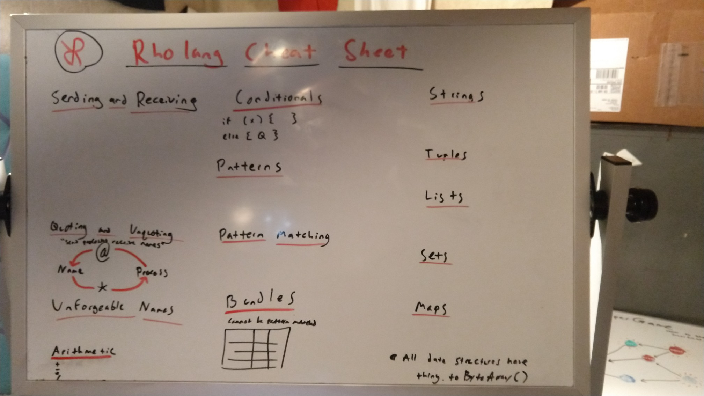

# Rholang Cheat Sheet Mockups

[jquery example](http://www.cheat-sheets.org/saved-copy/jquery12_colorcharge.png)
[python example](http://sixthresearcher.com/wp-content/uploads/2016/12/Python3_reference_cheat_sheet_front.png)

Original mockup with more detail


New mockup with proper ordering


# Content

## Sends and Receives
* `x!(P)` Send process P on name x
* `x!!(P)` Persistent send
* `for (y <- chan){P}` Receive name y on chan
* `for (@Q <- chan){P}` Receive Process Q (see pattern matching)
* `for (x <- c1; y <- c2){P}` Receive x and y simultaneously
* `for(y <= chan){P}` Persistent receive
* `contract chan(y) = {P}` Alternate persistent receive
* `for(y <! chan){P}` Peek at y on chan

## Quoting and Unquoting
"Send processes, Receive names"
```
     --@-- Process
   /         /  
Name <---\*--
```

## Unforgeable Names
* `new x, y, z in { P }` binds x, y, z in P
* ```new print(`rho:io:stdout`)``` use system powerbox

## Arithmetic
`+` addition
`-` substraction
`/` division
`*` multiplication
`%` **hopefully** mod coming soon

----------------------------------------------------------------------

## Conditionals
* `if (x) { P }` run process P iff x is `true`
* `else { Q }`   (optional) run process Q iff x is `false`

## Patterns

* A free variable
    * `x` binds with anything, while `@x` matches to a name and binds `x` to the quoted process.
* `Bool` `Int` `String` `Uri` `ByteArray` Type patterns
    * `@{Bool}` matches to both `@true` and `@false`
* `[ Head ... Tail ]` `Set( Subset ... Tail )` `{ Key : Value ... Tail }`
    * `[ 1 , 2 ... x ]` matches any list starting with `1, 2` and binds `x` to the remainder
* `ProcessPattern /\ ProcessPattern` Logical AND
    * `@{x /\ 100}` matches to `@100` and binds `x` to `100`.
* `ProcessPattern \/ ProcessPattern` Logical OR
    * `@"age"!(21 \/ 22)` matches to both `@"age"!(21)` and `@"age"!(22)`, **binds nothing**
* `~ ProcessPattern` Logical NOT
    * `~ Nil` matches to any process __except__ `Nil`

## Pattern Matching

* The patterns in:
    * `for( Pattern <- Name ){ Body }`
    * `for( Pattern <= Name ){ Body }`
    * `contract Name(Pattern){ Body }`

    Match against the processes in:
    * `Name!(Process)`
    * `Name!!(Process)`

* Each `Pattern_i` in:
    * `for( Pattern_1 <- Name_1 ; ... ; Pattern_N <- Name_N ){ Body }`
    * `for( Pattern_1 <= Name_1 ; ... ; Pattern_N <= Name_N ){ Body }`

    Matches against a `Process_i` in:
    * `Name_1!(Process_1) | ... | Name_N!(Process_N)`
    * `Name_1!!(Process_1) | ... | Name_N!!(Process_N)`

* Tries to match `Process` against each `Pattern_i` until it finds a match (or doesn't):
    * `match Process {
        Pattern_1 => { Body_1 }
        ...
        Pattern_N => { Body_N }
      }`


##  Bundles
Cannot be destructured by pattern matching

|        | Can Read | Can Write |
| ------ | -------- | --------- |
| `bundle- {proc}`  | YES |  NO |
| `bundle+ {proc}`  | NO  | YES |
| `bundle0 {proc}`   | NO  |  NO |
| `bundle {proc}`   | YES | YES |


----------------------------------------------------------------------

## Data Structures

### Strings
* `"Hello " ++ "World"` concatenation
* `"${greeting} World" %% {"greeting": "Hello"}` interpolation
* `"Hello World".slice(2, 8)"` "llo Wo"
* `"A402B6".hexToBytes()` interpret hex string

### Lists
* `[1, 2, Nil, "Hi"]`
* `list.nth(2)` Nil
* `list.length()` 4
* `list.slice(1, 3)` [2, Nil]

### Tuples
* `(1, 2, Nil, "Hi")`
* `tuple.nth(2)` Nil

### Sets
Sets have no order or duplicates
* `Set(1, 2, Nil, "Hi")`
* `set.union(Set(1, 4))` Set(1, 2, 4, Nil, "Hi")
* `set.delete(2)` Set(1, Nil, "Hi")
* `set.contains(5)` false
* `set.size()` 4

### Maps
* `{"a": 1, "b": 2}`
* `map.union({"c": 3})` {"a": 1, "b": 2, "c": 3}
* `map.delete("b")` {"a": 1}
* `map.contains("c")` false
* `map.get("b")` 2
* `map.getOrElse("d", "fail")` fail
* `map.set("b", 4)` {"a": 1, "b": 4}
* `map.keys()` Set("a", "b")
* `map.size()` 2


*All data structures have `toByteArray()`
