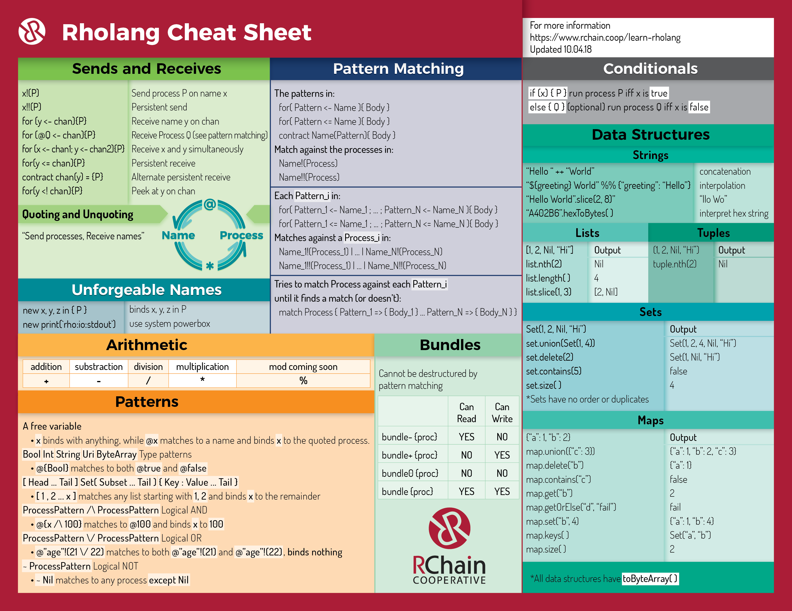

# Rholang Cheat Sheet

Download as [pdf](RholangCheetSheet_10.04.18.pdf) [png](RholangCheetSheet_10.04.18.png) [jpg](RholangCheetSheet_10.04.18.jpg)

# Errata

## Boolean Operators
`and` `or` `not`

## Crypto Channels
`secp256k1Verify`
`ed25519Verify`
Arguments: Data, signature, pubkey, return

`keccak256Hash`
`sha256Hash`
Arguments: Data, return

## Channel Nomenclature
The word "name" is heavily overloaded in rholang world. I've tried to start using "channel" in the context of the circle diagram. Should we update that, or is "name" permanently stuck in our vocab?
